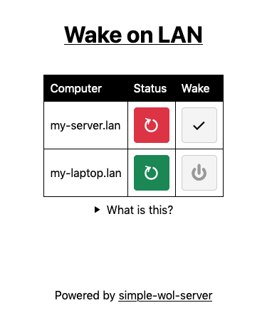

simple-wol-server
=================
A simple web server for sending Wake-on-LAN packets.

Deploying in production
=======================
1. Clone the repo
2. Configure the backend: Edit `simple_wol.py` and add your hostnames and MAC addresses to the
  `HOSTS` dictionary at the top.
3. Edit `run.sh` and configure it for your own setup. By default it uses `uwsgi` to run the
   application using 1 process and 8 threads on HTTP port 8387. See `uwsgi --help` for more options.
4. Run `run.sh` to build and run the application. After verifying it works, use the included
  `simple-wol-server.service` example to have it run at startup, restart if it fails, etc.

Development
===========
There are two parts to the application:
 - A static frontend built in JS using Svelte
 - A backend built in Python

Frontend
--------
- Install dependencies: `npm install`
- To build the application: `npm run build`
- To run a development server that automatically rebuilds as changes are made: `npm run dev`

Backend
-------
- Create a Python virtual environment and enter it: `python3 -m venv .venv; source .venv/bin/activate`
- Install the dependencies: `pip install -r requirements.txt`
- Running `./simple_wol.py` will launch a development server on port 8080 with auto-reloading and
  debugging turned on. Visit <http://localhost:8080> to see it.

Licence
=======
Licensed under the [GNU GPL v3](https://www.gnu.org/licenses/gpl-3.0.en.html)
